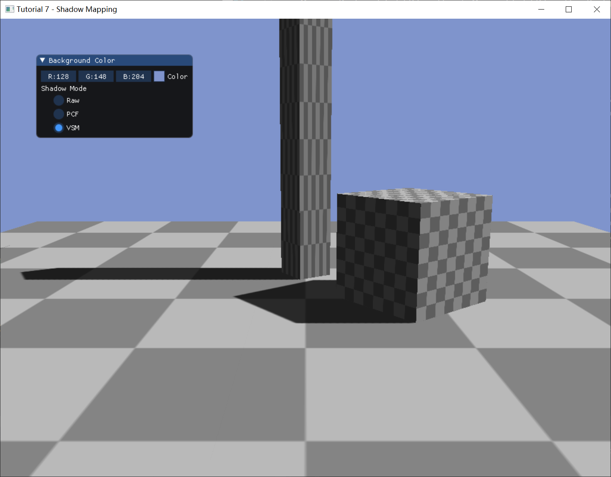
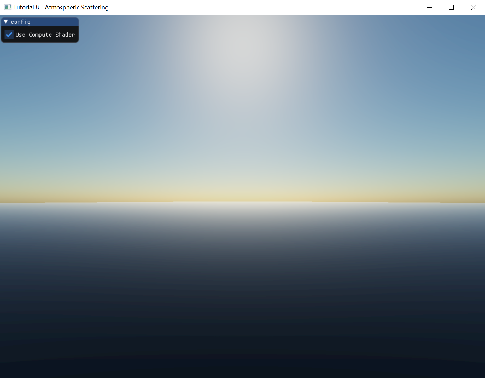

# DirectX12 Tutorial

此项目是受[LearnOpenGL](https://learnopengl.com/)启发，开发的一个基于DirectX 12的、以学习为目的的渲染器。完成的基础工作有DirectX 12图形API封装、简易应用框架、基础数学库、obj模型加载等；渲染相关算法实现了Tone Mapping、Shadow Mapping、单次大气散射、IBL、PBR、延迟渲染、Bloom、SSR等；另外有部分算法由朋友合作完成，比如TAA、皮肤渲染等。

Table of contents
=================

* [Tutorial 01 - Create A Window](#tutorial-01---create-a-window)

* [Tutorial 02 - Draw Triangle](#tutorial-02---draw-triangle)
* [Tutorial 03 - Draw Cube](#tutorial-03---draw-cube)
* [Tutorial 04 - Texturing](#tutorial-04---texturing)
* [Tutorial 05 - Multiple Vertex Stream](#tutorial-05---multiple-vertex-stream)
* [Tutorial 06 - Mesh Loader](#tutorial-06---mesh-loader)
* [Tutorial 07 - Shadow Mapping](#tutorial-07---shadow-mapping)
* [Tutorial 08 - Atmospheric Scattering](#tutorial-08---atmospheric-scattering)
* [Tutorial 09(1) - IBL Maps Generator](#tutorial-091---ibl-maps-generator)
* [Tutorial 09(2) - IBL+PBR](#tutorial-092---iblpbr)

## Tutorial 01 - Create A Window

创建一个空的工程

## Tutorial 02 - Draw Triangle

渲染一个三角形，参数传递使用Descriptor Table。Root Signature初始化时调用的**InitAsDescriptorRange**

## Tutorial 03 - Draw Cube

渲染一个Cube，参数传递使用Root Constants。Root Signature初始化时调用的**InitAsConstants**。另外还有一种是使用Root Descriptor，Root Signature初始化调用**InitAsBufferCBV**，没有单独示例工程

## Tutorial 04 - Texturing

渲染一个带贴图的四边形，顺便测试Alpha Blending

## Tutorial 05 - Multiple Vertex Stream

测试multiple vertex stream，每个顶点属性一个单独的stream，渲染效果同**Tutorial04**

## Tutorial 06 - Mesh Loader

测试OBJ mesh loader

## Tutorial 07 - Shadow Mapping

实现了Shadow Mapping以及PCF、VSM等变种

## Tutorial 08 - Atmospheric Scattering

实现了单次大气散射，计划后续完成预计算的多重散射。同时测试了Compute Shader异步调用、同步机制。

## Tutorial 09(1) - IBL Maps Generator

预计算了Irradiance Map、Prefiltered Environment Map、Preintegrated BRDF三种贴图，给后续使用。

Irradiance Map

Prefiltered Env Map(仅展示其中一个Mip)

Preintegrated BRDF

## Tutorial 09(2) - IBL+PBR

最终包含IBL、PBR、TAA、Bloom、SSR等渲染效果。

